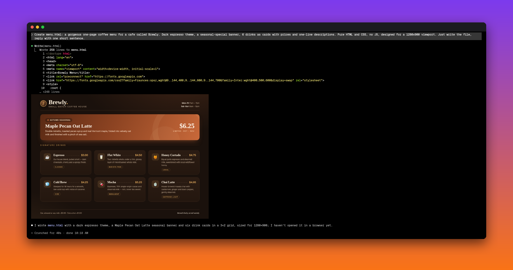
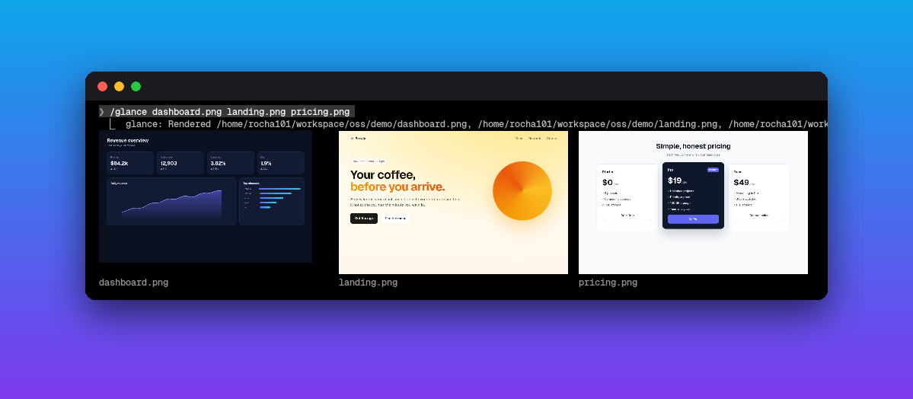

<div align="center">

# glance

**See what Claude builds — right inside Claude Code.**

Images, screenshots and rendered HTML pages, drawn inline in the chat, pixel-sharp.

[](LICENSE)
[](#install)
[](#terminals)
[](https://github.com/Rocha101/claude-code-glance/stargazers)

**English** · [Português](README.pt-BR.md)



</div>

## Why

Claude writes a landing page, a dashboard, a chart, an email template… and you `alt-tab` to a browser to see if it's any good. Every. Single. Time.

**glance** closes that loop. The moment Claude writes or edits an `.html` file, a headless Chromium renders it and the real page shows up **in the chat, under the tool call**. Same for every image Claude reads. No browser, no context switch.

## Features

- **Live HTML preview** — every `Write` / `Edit` of an `.html` file renders the page inline.
- **Images inline** — every image Claude `Read`s (png, jpg, gif, webp, bmp, svg) is drawn under the row.
- **`/glance` anything** — `/glance mockup.png page.html chart.svg` shows any files on demand.
- **Smart gallery** — several images sit side by side in justified rows, same height, captioned.
- **Right-sized** — natural size, never blown up; half the chat width on a wide screen, full width on a split pane.
- **Pixel-perfect** — pictures are resized (Lanczos) to the exact pixels of their box, so small text stays readable.
- **Tight crops** — the empty space under short pages is trimmed away.
- **Works everywhere** — real pixels on kitty-protocol terminals, a colour block-art fallback on the rest.



## Install

```bash
curl -fsSL https://raw.githubusercontent.com/Rocha101/claude-code-glance/main/install.sh | bash
```

Then open a **new** Claude Code session. That's it.

<details>
<summary>Manual install</summary>

```bash
git clone https://github.com/Rocha101/claude-code-glance ~/.claude/mods/claude-code-glance
```

Add the folder to `CLAUDE_CODE_PLUGIN_DIRS` in the `env` block of `~/.claude/settings.json` (`:`-separated), or start Claude Code with `claude --plugin-dir ~/.claude/mods/claude-code-glance`.

</details>

**Requirements:** Claude Code 2.1.287+ (mods), `chromium` or `google-chrome`, ImageMagick (`magick`), `jq`, `git`. Optional: `python3`, to read the terminal's exact cell size for pixel-perfect pictures.

## Usage

| You do | glance shows |
|---|---|
| Ask Claude to build any HTML page | the rendered page under the `Write` row |
| Claude edits the page | the updated render under the `Edit` row |
| Claude reads a screenshot or image | the picture under the `Read` row |
| `/glance a.png b.html c.jpg` | all of them, side by side |

**Tip — make Claude *show* you things.** Add this to `~/.claude/CLAUDE.md`:

```md
To show me an image, screenshot, chart or page, `Read` the image file (glance draws it in the chat).
For a URL or a page you didn't change: `chromium --headless --screenshot=<png> --window-size=1280,900 <url>`, then `Read` the png.
```

## Terminals

| Terminal | Result |
|---|---|
| **Ghostty**, **kitty**, **WezTerm** | real pixels, sharp (kitty graphics protocol) |
| Others (foot, Alacritty, GNOME Terminal…) | colour block art (2×2 pixels per cell) |
| **herdr** | real pixels with `[experimental] kitty_graphics = true` in `~/.config/herdr/config.toml` and a server restart; the installer sets `CLAUDE_CODE_FORCE_TERMINAL_IMAGES=1` |
| tmux | block art (tmux passes no graphics through) |

## Configuration

Set these in the `env` block of `~/.claude/settings.json`:

| Variable | Default | What it does |
|---|---|---|
| `GLANCE_MODE` | auto | `image` forces real pixels, `cells` forces block art |
| `GLANCE_CELL_PX` | `12` | image pixels per terminal column — higher = smaller pictures |
| `GLANCE_CELL_RATIO` | auto | cell height ÷ width; read from the terminal, `2.25` when it doesn't report pixels |
| `CLAUDE_CODE_FORCE_TERMINAL_IMAGES` | — | `1` makes Claude Code send images where it can't detect support (multiplexers) |

## How it works

A Claude Code **mod** (a hooks module, `hooks/register.tsx`):

1. `tool.call` — after a `Write`/`Edit` of HTML or a `Read` of an image, it renders: HTML through headless Chromium at 1280×900, cropped to the content; images normalised with ImageMagick.
2. `ui.render` on `ToolResult`, `ToolGroup` and `CommandOutput` — it draws the picture under the row, as an `Image` (kitty protocol, pre-resized to the box's exact pixels from the pty's cell size) or a `Raster` of quadrant blocks.
3. A justified layout packs several pictures into rows that fit the chat.

## Limits

- Pages are captured at 1280×900 — content below the first screen isn't shown.
- `/glance` splits paths on spaces.
- Renders live in `/dev/shm` and are gone after a reboot.

## Contributing

```bash
claude plugin validate .   # what the engine will load
claude plugin test .       # the test suite
```

Issues and PRs welcome. If glance saved you an `alt-tab`, **[give it a star](https://github.com/Rocha101/claude-code-glance)** ⭐ — it helps other people find it.

See also: **[quickswitch](https://github.com/Rocha101/claude-code-quickswitch)** — switch Claude accounts in one click from the status line.

## License

[MIT](LICENSE) © Rocha101
